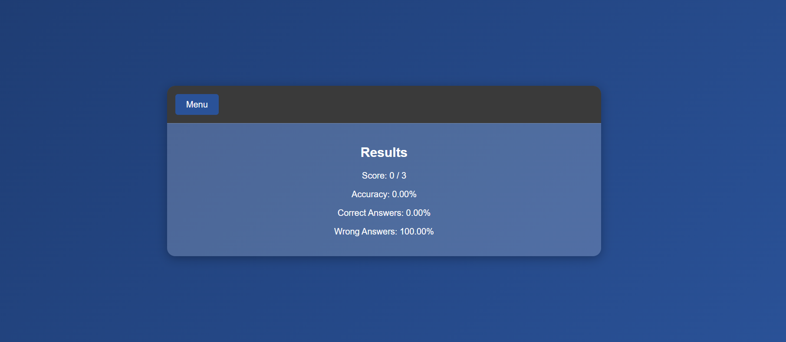

# Quiz App

This is a simple quiz application that allows users to answer multiple-choice questions interactively.

## Features

- Multiple-choice questions.
- Navigation buttons to move between questions (Previous, Next).
- Submit button to finalize the quiz.
- Result display after submission.

## Folder Structure

```
project-directory/
|-- style.css           # CSS file for styling the application
|-- script.js           # JavaScript file for application logic
|-- index.html          # Main HTML file
```

## How to Use

1. Clone the repository or download the project files.
2. Open `index.html` in your browser to launch the quiz app.

## File Descriptions

### `index.html`
The main HTML file that structures the quiz interface. It includes:
- A navigation menu.
- Multiple-choice question options.
- Buttons for navigation (Previous, Next) and submission.
- A results section to display the final quiz score or answers review.

### `style.css`
The CSS file that provides styling for:
- The quiz layout.
- Button hover effects.
- Responsive design for different screen sizes.

### `script.js`
The JavaScript file that manages:
- Handling user interactions with the quiz options.
- Navigation between questions.
- Calculating and displaying the final results.

## How It Works

1. Users start the quiz and select an answer for each question.
2. Navigation buttons allow moving back and forth between questions.
3. Clicking the Submit button finalizes the quiz and displays the results.

## Future Improvements

- Add a timer for each question.
- Fetch questions dynamically from an API.
- Provide feedback for correct and incorrect answers after each question.
- Store results in local storage or a database.

## Screenshots

### Quiz Interface


### Results Page


## License

This project is open-source and available for modification and use under the MIT License.


